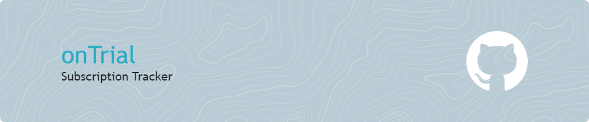

# onTrial - Easily manage your subscriptions!

Take control of your subscriptions with OnTrial Subscription Tracker! Easily manage and monitor your subscriptions, and stay ahead of billing dates with timely notifications. Simplicity and awareness, all in one app

## 🚀 Features

- **Comprehensive Subscription Overview**: Effortlessly access a detailed dashboard displaying each subscription's name, cost, billing cycle, and current status, enabling a clear snapshot of your digital commitments at a glance.
- **Seamless Subscription Management**: Utilize intuitive Create, Read, Update, and Delete (CRUD) operations to effortlessly add new subscriptions, modify existing ones, or remove those no longer needed, all through a user-friendly interface.
- **Proactive Billing Alerts**: Stay ahead of your finances with precision-timed notifications for upcoming bills, powered by reliable scheduling technology. Never miss a payment or get caught by surprise charges again.

## 🛠️ Prerequisites

      
      
      
      
      

## 🚦 Running the Project

o run the project in your local environment, follow these steps:

1. Clone the repository to your local machine.
2. Run `npm install` or `yarn` on both server and client directory to install the required dependencies.
3. Run `nodemon` to start the backend server.
4. Access the server at http://localhost:3000 (or the adress shown in your console).
5. Run `npm run dev` or `yarn dev` to get the project started.
6. Open [http://localhost:5173](http://localhost:5173) (or the address shown in your console) in your web browser to view the app.

Your default web browser should open the application automatically.

Any question?! Reach out to me.

## 📸 Video

https://github.com/ByteBlink/OnTrial-Subscriptions-Tracker/assets/113640221/1bf0bca7-7b86-402d-8806-582e1ba7a7ce
